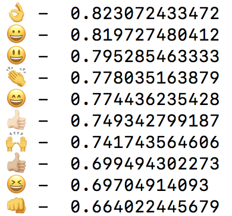

# How Cosmopolitan Are Emojis?

TL;TR: We study emoji embeddings trained on tweets posted in different countries. 

[PDF of the paper](https://repositori.upf.edu/bitstream/handle/10230/32660/barbieri_MM16_emoj.pdf?sequence=1&isAllowed=y)

Choosing the right emoji to visually complement or condense the meaning of a message has become part of our daily life. Emojis are pictures, which are naturally combined with plain text, thus creating a new form of language. These pictures are the same independently of where we live, but they can be interpreted and used in different ways. 
In this paper we compare the meaning and the usage of emojis across different languages. Our results suggest that the overall semantics of the subset of the emojis we studied is preserved across all the languages we analysed. However, some emojis are interpreted in a different way from language to language, and this could be related to socio-geographical differences.


## Download Embeddings
The dimension of the skipgram vectors is 300 with window 6 (vocab min count = 10). We trained the embedding using all the tokens, emojis and punctuation included (links are removed and user anonymized with "@user"). The dataset used was of 20M geolocalized tweets posted from October 2015 to February 2017. In each link you find the lowercased and not lowercased version.

* USA ([100](TODO), [300](https://drive.google.com/drive/folders/0B13VF_-CUsHPd3FqdVJ2c1ZJaXc?usp=sharing))
* United Kingdom ([100](TODO), [300](https://drive.google.com/drive/folders/0B13VF_-CUsHPZkZnYXduYTA5VUU?usp=sharing))
* Spain ([100](TODO), [300](https://drive.google.com/drive/u/1/folders/0B13VF_-CUsHPaURab2pWZEJ5bGc))
* Italy ([100](TODO), [300](https://drive.google.com/drive/folders/0B13VF_-CUsHPUU85bjRSXzBKNFE?usp=sharing))

## Example
Emojis can be tricky to handle, they are composed of one or more unicode character ([full list](http://unicode.org/emoji/charts/full-emoji-list.html)). This is a simple use case with gensim:

```python
from gensim.models.keyedvectors import KeyedVectors
#loading the model can take a minute or so
model = KeyedVectors.load_word2vec_format('model_swm_300-6-10-low.w2v', binary=False)
c = "👍"
nn = model.most_similar(positive=[c.decode('utf-8')])
for e,s in nn:
  print e + "  -  " + str(s) 
```



Also, have a look at [this library](https://github.com/fvancesco/emoji) if you have troubles with emoji unicode.

## Citation

The provided models are freely available under [Creative Commons CC BY 3.0](https://creativecommons.org/licenses/by/3.0/), using the reference below for attribution.

```bash
@inproceedings{barbieri2016cosmopolitan,
  title={How Cosmopolitan Are Emojis?: Exploring Emojis Usage and Meaning over Different Languages with Distributional Semantics},
  author={Barbieri, Francesco and Kruszewski, German and Ronzano, Francesco and Saggion, Horacio},
  booktitle={Proceedings of the 2016 ACM on Multimedia Conference},
  pages={531--535},
  year={2016},
  organization={ACM}
}
```
